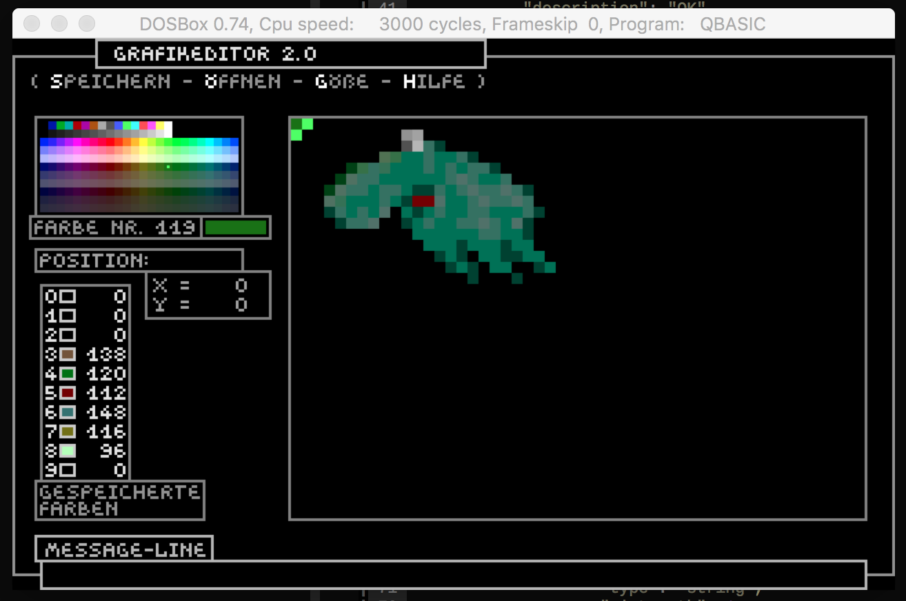

# QED.bas

A graphical EDitor for DOS written QBasic.



## Usage

Inside `dosbox`:

```
mount c ~/path/to/the/code
qbasic /run qedit.bas
```

### Keys

- "shift-left":   " paint"
- "space/leer":   " paint"
- "strg/crtl":    " pick colour"
- "enter + zahl": " save colour (cell 0-9)"
- "alt + zahl":   " recall saved colour (cell 0-9)"
- "cursortasten": " move cursor"
- "z":            " zoom (1:1, 2:1, 4:1)"
- "f1":           " help"
